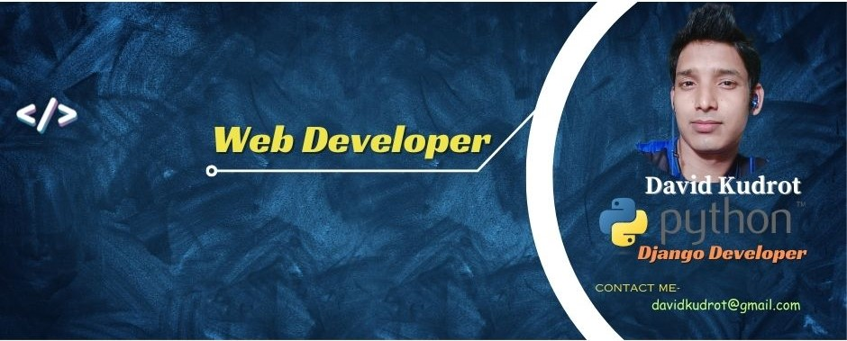

# 🚀 David Kudrot

<h3 align="center">💻 Python Developer | Django & DRF Specialist | React Developer</h3>
<h4 align="center">🌍 Building Scalable Real-World Web Applications</h4>

---

## 👋 About Me

Hi, I'm **David Kudrot**, a passionate Full Stack Developer focused on building scalable, secure, and production-ready applications.

- 🐍 Python Developer at Dr.Tech  
- 🌐 Backend Specialist (Django & DRF)  
- ⚛️ React Frontend Developer  
- 🖥️ VPS Deployment & Server Management  
- 🚀 Building Real-World Business Applications  

I love solving real business problems with clean architecture and efficient backend logic.

---

## 🛠️ Tech Stack

### 🚀 Backend
- Python  
- Django  
- Django REST Framework  
- Flask  

### 🎨 Frontend
- React  
- Tailwind CSS  
- Bootstrap 5  
- JavaScript  

### 🗄️ Database
- PostgreSQL  
- MySQL  
- SQLite  

### ⚙️ DevOps & Tools
- Git & GitHub  
- Linux VPS (Hostinger KVM)  
- Nginx  
- Gunicorn  
- Postman  
- VS Code  

---

## 📌 Featured Projects

### 🏫 School Management System
A complete ERP solution including:

- Student Information Management  
- Fees Collection System  
- Online & Offline Examination  
- QR Code Attendance  
- HR & Payroll  
- Multi-Branch Support  
- Reports & Analytics  

**Tech Used:** Django, DRF, Bootstrap, PostgreSQL  

---

### 🌍 FITD – Import Export Business Website
Modern responsive business website with:

- Dynamic Product Listing  
- Certificate Management  
- Clean UI using React + Tailwind  
- Backend ready with Django REST Framework  

---

### 🛒 Multivendor E-commerce System (Real World Level)

- Vendor Dashboard  
- Product Management  
- Order Processing  
- Role-Based Authentication  
- API Architecture Design  
- Secure Payment Integration Ready  

---

## 📊 GitHub Stats

  

  

---

## 🌐 Connect With Me

- 💼 LinkedIn: https://linkedin.com/in/YOUR_LINK  
- 🌍 Portfolio: https://YOUR_PORTFOLIO_LINK  
- 📧 Email: YOUR_EMAIL  

---

## 🎯 Career Objective

To build scalable digital systems that solve real-world business problems and to continuously grow as a professional Full Stack Developer.

---

## ⭐ Why Work With Me?

✔ Clean & Maintainable Code  
✔ Real-World Deployment Experience  
✔ Secure Authentication Systems  
✔ API Development & Integration  
✔ Business-Oriented Thinking  
✔ Continuous Learner  

---

  🔥 Always building. Always improving. Always shipping.

